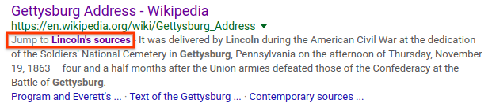

# Supporting CSS selectors when navigating to a URL fragment

## Introduction

To enable users to easily navigate to specific content in a web page, we propose adding support for specifying a CSS selector as the [indicated part of the document](https://html.spec.whatwg.org/multipage/browsing-the-web.html#the-indicated-part-of-the-document).

Web standards currently specify support for scrolling to anchor elements with name attributes, as well as DOM elements with ids, when [navigating to a fragment](https://html.spec.whatwg.org/multipage/browsing-the-web.html#scroll-to-fragid). While named anchors and elements with ids enable scrolling to limited specific parts of web pages, not all documents make use of these elements, and not all parts of pages are addressable by named anchors or elements with ids.

## Motivating Use Cases

When following a link to read a specific part of a web page, finding the relevant part of the document after navigating can be cumbersome. This is especially true on mobile, where it can be difficult to find specific content when scrolling through long articles or using the browser's "find in page" feature. Fewer than 1% of clients use the "Find in Page" feature in Chrome on Android.

To enable scrolling directly to a specific part of a web page, we propose generalizing the existing support for scrolling to elements based on the fragment identifier. We believe this capability could be used by a variety of websites (e.g. search engine results pages, Wikipedia reference links), as well as by end users when sharing links from a browser.

### Search Engines

Search engines, which link to pages that contain content relevant to user queries, would benefit from being able to scroll users directly to the part of the page most relevant to their query.

For example, Google Search currently links to named anchors and elements with ids when they are available.  For the query "lincoln gettysburg address sources", Google Search provides a link to the named anchor [#Lincoln’s_sources](https://en.wikipedia.org/wiki/Gettysburg_Address#Lincoln's_sources) for the [wikipedia page for Gettysburg Address](https://en.wikipedia.org/wiki/Gettysburg_Address) as a "Jump to" link:



However, there are many pages with relevant sub passages with no named anchor or id, and search engines cannot provide a "Jump to" link in such cases.

### Referencing / sharing a specific passage in a web page

When referencing a specific section of a web page, for example as part of sharing that content via email or on social media, it is desirable to be able to link directly to the specific section. If a section is not linkable by a named anchor or element with id, it is not currently possible to share a link directly to a specific section. Users may work around this by sharing screenshots of the relevant portion of the document (preventing the recipient of the content from engaging with the actual web page that hosts the content), or by including extra instructions to scroll to a specific part of the document (e.g. "skip to the sixth paragraph"). We would like to enable users to link to the relevant section of a document directly. Linking directly to the relevant section of a document preserves attribution, and allows the user following the URL to engage directly with the original publisher.

## Proposed Solution

We propose generalizing [existing support](https://html.spec.whatwg.org/multipage/browsing-the-web.html#find-a-potential-indicated-element) for scrolling to elements as part of a navigation, by adding support for specifying a CSS selector in the fragment of a web page URL, and using the element specified by the CSS selector as the [indicated part of the document](https://html.spec.whatwg.org/multipage/browsing-the-web.html#the-indicated-part-of-the-document). The user agent would then follow the existing logic for [scrolling to the fragment identifier](https://html.spec.whatwg.org/multipage/browsing-the-web.html#scroll-to-the-fragment-identifier) as part of performing a navigation.

This extends the existing support for scrolling to anchor elements with name attributes, as well as DOM elements with ids, to scrolling to other elements in a web page.

Browsers that support [scroll anchor serialization](https://bugs.chromium.org/p/chromium/issues/detail?id=734679) may wish to implement this feature using the browser’s scroll anchor serialization and restoration implementation, as scroll anchor serialization provides a mechanism to scroll to an element identified by a CSS selector.

### Encoding the scroll target in the URL fragment

We propose encoding a [Complex CSS Selector](https://www.w3.org/TR/selectors/#complex) in the URL fragment, prefixed with the ```targetElement=``` string. For example, ```#targetElement=.myclass``` would cause the first element with classname myclass to be selected as the indicated part of the document. Any Complex CSS Selector would be supported.

Though existing HTML support for id and name attributes specifies the target element directly in the fragment, most other mime types make use of this x=y pattern in the fragment, such as [PDF](https://tools.ietf.org/html/rfc3778#section-3) (e.g. #page=12) or [CSV](https://tools.ietf.org/html/rfc7111#section-2) (e.g. #row=4).

#### Example fragments

| URL Fragment                                 | Element selected                                                  | Example matching HTML                                                        |
| -------------------------------------------- | ----------------------------------------------------------------- | ---------------------------------------------------------------------------- |
| ```#targetElement=#maincontent>p:nth-of-type(3)``` | 3rd paragraph element within an element with id "maincontent"     | ```<div id=maincontent><p>1st pgh<p>2nd pgh<p>Target pgh</div>```            |
| ```#targetElement=img[src$="img.jpg"]```           | img element, with a src URL attribute ending in "img.jpg"         | ``` or ```          |
| ```#targetElement=span.foo.bar```                  | span element, with classes "foo" and "bar"                        | ```<span class="foo bar">target span</span>```                               |
| ```#targetElement=a[href="http://example.com/"]``` | link element, with an href URL attribute of "http://example.com/" | ```<a href=[http://example.com/](http://www.example.com/)>target link</a>``` |
| ```#targetElement=#article>div.intro>h2+p```       | Paragraph immediately following h2 element, within a div with class "intro", with parent with id "article" | ```<div id=article><div class=intro><h2>Title</h2><p>Target pgh...``` |

#### URL fragment encoding

In order to specify a CSS selector in the fragment of a web page URL, the author must encode the selector in a way that produces a valid URL fragment.

The [URL standard](https://url.spec.whatwg.org/) specifies that a fragment can contain [URL code points](https://url.spec.whatwg.org/#url-code-points), as well as [UTF-8 percent encoded characters](https://url.spec.whatwg.org/#utf-8-percent-encode). Characters in the [fragment percent encode set](https://url.spec.whatwg.org/#fragment-percent-encode-set) must be percent encoded.

What this means in terms of the spec's processing model is that we will look at the already-parsed URL record, which has done any applicable percent-decoding for us, and directly use the result as a CSS selector.

## Alternatives Considered

### Increase use of elements with named anchors / id attributes in existing web pages

As an alternative, we could ask web developers to include additional named anchor tags in their pages, and reference those new anchors. There are two issues that make this less appealing. First, legacy content on the web won’t get updated, but users consuming that legacy content could still benefit from this feature. Second, it is difficult for web developers to reason about all of the possible points other sites might want to scroll to in their pages. Thus, to be most useful, we prefer a solution that supports scrolling to any point in a web page.

### JavaScript-based API (instead of URL fragment)

We also considered specifying the target element via a JavaScript-based navigation API, such as via a new parameter to location.assign(). It was concluded that such an API is less useful, as it can only be used in contexts where JavaScript is available. Sharing a link to a specific part of a document is one use case that would not be possible if the target element was specified via a JavaScript API. Using a JavaScript API is also less consistent than existing cases where a scroll target is specified in a URL, such as the existing support in HTML, as well as support for other document formats such as PDF and CSV.

## Future Work

In addition to scrolling to a specific element in a document, it is sometimes desirable to scroll to  a specific part of content within an element (for example, a sentence of text within a large paragraph element). In subsequent work, we would like to add support for specifying optional scroll target text within a target scroll element. A user would be able to specify a substring of text within the target element as part of the URL fragment, and the user agent would scroll to that substring within the target element upon navigation. For example, if a user wishes to reference a sentence of text within a paragraph ([example](https://twitter.com/dcgisenyi/status/980817369340801024)), they could specify both the target element, along with a substring of text ("they were going to know me as Zanyiwe Madikizela" in the linked example). This ‘scroll to text’ behavior has been proposed in previous [draft RFCs](http://zesty.ca/crit/draft-yee-url-textsearch-00.txt) and other [proposals](https://indieweb.org/fragmention).

We are not aware of any existing specifications for matching a substring of text within a document. While a basic character-by-character comparison may suffice for some use cases, we may also wish to support cases where the text spans multiple DOM nodes. For example, given the snippet of HTML ```<div>The quick brown fox <b>jumps</b> over the lazy dog</div>```, in order to match the string "The quick brown fox jumps", the text matching algorithm needs to understand how to match text that spans multiple nodes in the DOM. If no existing specs are available for matching text, this behavior may need to be specified as part of standardization of scrolling to text.

Finally, we hope to support highlighting of the target element and/or target text upon scroll. Some sites already provide support for this in their CSS, but it is not supported consistently across the web. For example, StackOverflow highlights an answer if its identifier is specified in the fragment of the URL ([example](https://stackoverflow.com/questions/1139763/what-does-the-plus-sign-css-selector-mean#1139776)).

## Additional Considerations

### Browser compatibility and fallback behavior

A browser that doesn’t support this feature will silently ignore the scroll target and fall back to the existing browser behavior of not scrolling the document. As such, this feature is seen as low risk.

## Related Work / Additional Resources

Scroll Anchoring

* [https://drafts.csswg.org/css-scroll-anchoring/](https://github.com/WICG/ScrollAnchoring/blob/master/explainer.md)
* [https://docs.google.com/document/d/1YaxJ0cxFADA_xqUhGgHkVFgwzf6KXHaxB9hPksim7nc/edit](https://docs.google.com/document/d/1YaxJ0cxFADA_xqUhGgHkVFgwzf6KXHaxB9hPksim7nc/edit)

Scroll to text

* [http://zesty.ca/crit/draft-yee-url-textsearch-00.txt](http://zesty.ca/crit/draft-yee-url-textsearch-00.txt)
* [https://indieweb.org/fragmention](https://indieweb.org/fragmention)

Other

* [http://simonstl.com/articles/cssFragID.html](http://simonstl.com/articles/cssFragID.html)
* [https://en.wikipedia.org/wiki/Fragment_identifier#Examples](https://en.wikipedia.org/wiki/Fragment_identifier#Examples)
* [https://www.w3.org/TR/2017/REC-annotation-model-20170223/](https://www.w3.org/TR/2017/REC-annotation-model-20170223/)

## Contributors

Bryan McQuade, Patrick Noland, Domenic Denicola, Grant Wang, Sundeep Tirumalareddy, Ryan Schoen
